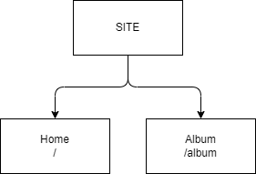

```
Følgende Udfordringer.
```

# Opgave Grubler.

Læs **ALLE TRIN** inden du får igang - så du har et lille overblik over opgaver og måske det former din tankegang i forhold til hvordan du griber det an.

## Trin 1.



### Arbejd Selv
* Opret et nyt frisk projekt med en global navigation, iconer, fonte.
    * Du kan genbruge et gammelt projekt som du tilpasser, det er op til dig.
    * Det er en god ide at "øve" sig i at lave et projekt klar, det gør dig istand til hurtigt at teste/ændre fremover og hver gang bliver du klogere på din opsætning.

* Projektet skal i første omgang have følhende struktur.
    * En Forside.
    * En Album side.

* Der skal linkes til begge sider fra den globale menu.
    * "/"
    * "/album"

## Trin 2.

### Der Undervises.
* Undervisning - Hooks.
    1. Opretter Album Komponent og stylesheet
    2. Oprette useFetch og useAlbum

Hook Skabelon
```javascript
const useFetch = (id) => {

    const name = "A hook"

    return {
        name
    }
};
export default useFetch;
```

Album Skabelon
```javascript
import styles from './album.module.css'
const Album = ({id}) => {

    const {album, picture, next, previous, goto, currentIndex, loading} = useAlbum(id);

    return (
        <div className={styles.album}>
           
        </div>
    );

};

export default Album;
```

Album Stylesheet
```
.album {
    border: 5px solid purple;
    position: relative;
    color: #fff;
    background-color: black;
    display: flex;
    flex-direction: column;
    align-items: center;
    gap: 20px;
    padding: 20px;
    height: 100vh;
}
```

