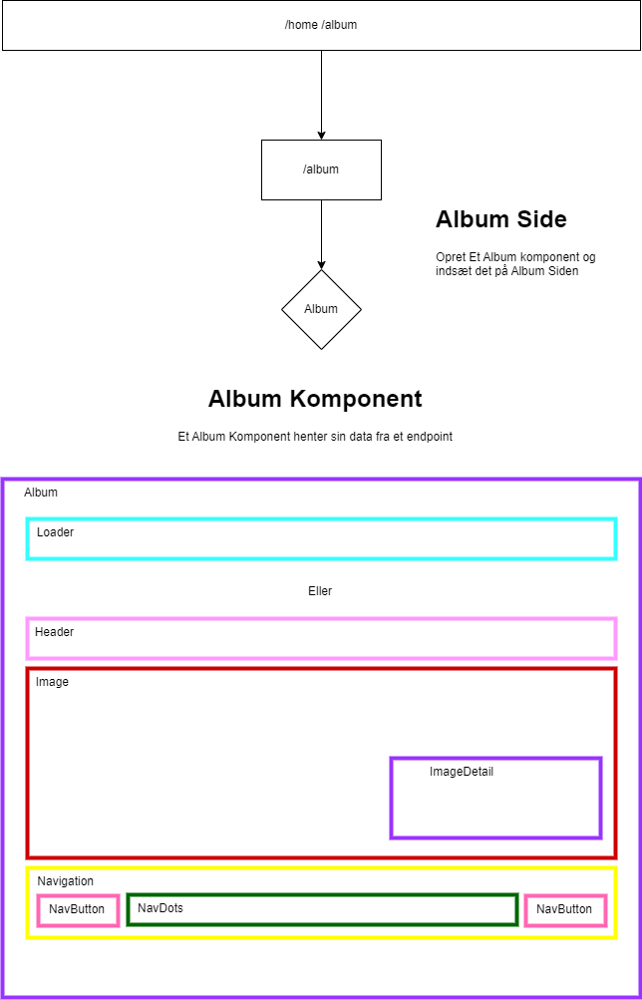

```
Følgende Udfordringer.
```

# Opgave Grubler.

Læs **ALLE TRIN** inden du får igang - så du har et lille overblik over opgaver og måske det former din tankegang i forhold til hvordan du griber det an.

## Trin 3.

Nu har vi lavet vores useAlbum hook og vi kan loade et album nu skal vi lave vores egen billede album.
Der er efterladt nogle tomme metoder som er de metode albummet skal benyttet.

Manglende metoder:
`next` for at vælge/sætte næste billede.
`previous` for at vælge/sætte forrige billede.
`goto` for at gå til/sætte et specifikt billede.

```javascript
import { useEffect, useRef, useState } from "react";

const useAlbum = (id) => {

    const [album, setAlbum] = useState([]);
    const [currentIndex, setCurrentIndex] = useState(0);
    const [picture, setPicture] = useState({});
    const [loading, setLoading] = useState(false);
   
    const getAlbum = async () => {

        let response = await fetch(`https://photos.webmcdm.dk/album?id=${id}`);
        let result = await response.json();
        let a = result.data;
  
        setAlbum(a);
        setPicture(result.data.pictures[currentIndex]);

        setTimeout(() => {
            setLoading(false);
        }, 4000);
        
    }

    const next = () => {
    
    }

    const previous = () => {
 
    }

    const goto = (index) => {
    
    }

    useEffect(() => {

        setLoading(true);
        getAlbum();

    }, []);    
    
    return {
      album,
      picture,
      next,
      previous,
      goto,
      currentIndex,
      loading
    }
};
export default useAlbum;
```

Vi har vores Album komponent.

```javascript
import styles from './album.module.css'
import useAlbum from "../../../../hooks/useAlbum";
import { ClipLoader } from 'react-spinners';

const Album = ({id}) => {

    const {album, picture, next, previous, goto, currentIndex, loading} = useAlbum(id);

    return (
        <div className={styles.album}>
            { loading ? 
                <ClipLoader
                    color={"#fff"}
                    loading={loading}
                    size={150}
                    aria-label="Loading Spinner"
                    data-testid="loader"
                />
            : <>
                <div>Album</div>
            </>
            }
        </div>
    );

};

export default Album;
```



### Følg billedet og skab et Album af billeder og benyt/opret følgende komponenter.

* `<AlbumHeader>` 
* `<AlbumImage>` 
    * `<AlbumImageDetail>`
* `<AlbumNavigation>`
    * `<AlbumDots>`
    * `<AlbumNavButton>`
* `<AlbumLoader>`

### Indhold
1. AlbumHeader
    * Album titel.

2. AlbumImage
    * Billede.
    * Billede Detaljer.
        * description
        * format
        * width
        * height

3. AlbumNavigation
    * Dots der kan navigere til et spcifikt billede.
    * Dynamisk i forhold til hvormange billeder der er i vores album.
    * Next knap til nøste billede.
    * Previous til forrige billede.

1. AlbumLoader
    * Indeholder en Loading Status der vises så længe `loading` er `true` i useAlbum hook´en.

Opret nu et Album der viser ét billede af gangen med en beskrivelses boks.

